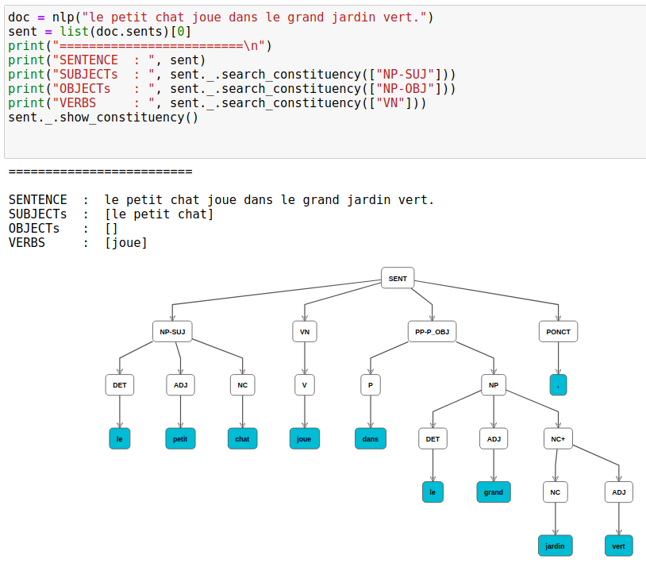

# Constituency Parsing visualization for [Berkeley Neural Parser](https://spacy.io/universe/project/self-attentive-parser) and [spacy](https://spacy.io/) in Jupyter Notebook

## Installation
Install [ipydagred3](https://github.com/timkpaine/ipydagred3)
```bash
pip install ipydagred3
jupyter nbextension enable --py --user ipydagred3
```

## Usage
```python
# create your doc
doc = nlp("le petit chat joue dans le grand jardin vert.")

# get the desired sentence
sent = list(doc.sents)[0]

# search the constituency tree for some items : Array(Name)
# it returns a SpaCy::span of the parts that matches
sent._.search_constituency(["NP-SUJ"]))
# > Array(SpaCy:span)[le petit chat]

# display the constituency tree in jupyter notebook
sent._.show_constituency()
```

## Preview

